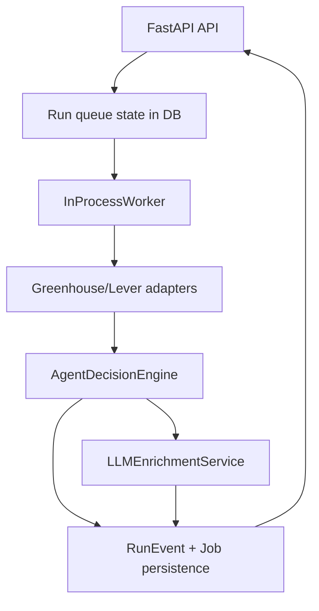

# ARCHITECTURE

## Components

- **API Layer** (`autoapply_agent.api`): FastAPI routes for health, source config, run lifecycle, and jobs listing.
- **Worker** (`autoapply_agent.services.worker`): in-process async polling loop that claims queued runs.
- **Adapters** (`autoapply_agent.adapters`): Greenhouse and Lever HTTP parsers.
- **Agent Decision Engine** (`autoapply_agent.services.agent_decision`): deterministic scoring + rationale + priority + planning synthesis.
- **LLM Enrichment Service** (`autoapply_agent.services.llm_enrichment`): optional Gemini/Kimi/Claude/GPT summary augmentation for decision traces.
- **Domain Services** (`autoapply_agent.services.scoring`, `planning`): deterministic policy primitives used by the decision engine.
- **Persistence** (`autoapply_agent.db`): SQLAlchemy async models/session with SQLite.

## Agent Loop

The system follows an explicit Observe -> Decide -> Act loop:

1. **Observe:** source adapters fetch and parse public posting pages.
2. **Decide:** decision engine computes score, priority tier, matched terms, and rationale.
3. **Act:** worker optionally consumes provider LLM output, then persists job + decision trace and emits timeline events for API consumers.

## Run Lifecycle

1. Client creates run (`POST /runs`) -> run status `queued`, event `run.created`.
2. Worker claims queued run -> status `running`, event `run.started`.
3. Worker resolves source configs, fetches jobs per source, and evaluates each job with the agent decision engine.
4. Worker persists source and summary events.
5. Run reaches terminal state: `completed`, `cancelled`, or `failed`.

## Run State Transitions

| From | To | Trigger |
|---|---|---|
| `queued` | `running` | Worker claim succeeds |
| `queued` | `cancelled` | API cancel requested before claim |
| `running` | `completed` | All enabled sources processed |
| `running` | `cancelled` | Cancellation observed by worker loop |
| `running` | `failed` | Unhandled execution error |

## Persistence Model

- `Run`: lifecycle state and user query.
- `RunEvent`: ordered event stream for observability.
- `SourceConfig`: source adapter configuration.
- `Job`: normalized job snapshot tied to run, including `agent_decision` trace in `raw`.

## Event Contracts

- `run.created`, `run.started`, `run.completed`, `run.failed`, `run.cancelled`
- `source.started`, `source.completed`, `source.failed`, `source.unsupported`
- `agent.decision` with score, priority tier, and matched terms
- `agent.llm_enrichment` with provider/model metadata when LLM integration is enabled

## Migrations

- Alembic scaffold included under `alembic/` and `alembic.ini`.
- Runtime creates tables for local simplicity; migrations are ready for incremental schema control.
