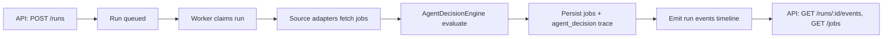

# agentic-career-search

<p align="left">
  <a href="https://github.com/Francis1998/agentic-career-search/actions/workflows/ci.yml"></a>
  
  
  
  
</p>

An autonomous AI-agent orchestration backend for job discovery.

Built to demonstrate real agent engineering, not just prompt wrappers:
- explicit run lifecycle state machine,
- Observe -> Decide -> Act execution loop,
- pluggable tool adapters for external sources,
- traceable agent decisions with rationale,
- deterministic, testable behavior under CI.

LLM provider integration is supported for decision enrichment, including:
- **Gemini API** responses,
- **Kimi (Moonshot) API** responses,
- **Claude API** responses.

## Demo Preview


### Demo Gallery

| Demo | Preview |
|---|---|
| Core Agent Loop |  |
| LLM Provider Flow |  |
| Ops Reliability Loop |  |

## Table of Contents

- [Demo Preview](#demo-preview)
- [Demo Gallery](#demo-gallery)
- [Showcase Value](#showcase-value)
- [System Flow](#system-flow)
- [What The Agent Produces](#what-the-agent-produces)
- [API Surface](#api-surface)
- [Quick Demo](#quick-demo)
- [Project Structure](#project-structure)
- [Safety and Scope](#safety-and-scope)
- [Additional Docs](#additional-docs)

## Showcase Value

This repository is designed as a portfolio-grade AI agent systems project:

- **Agent loop orchestration** with durable run/event memory.
- **Decision engine** that emits score, priority tier, and rationale for each candidate.
- **LLM augmentation layer** that consumes provider outputs from Gemini, Kimi, or Claude.
- **Tool abstraction layer** for heterogeneous web sources (`Greenhouse`, `Lever`).
- **Operational controls** including cancellation, timeouts, bounded ingestion, and health probes.
- **Engineering rigor** with strict typing, linting, integration tests, and GitHub Actions.

## System Flow



## What The Agent Produces

For each discovered job, the system persists:
- normalized job payload,
- deterministic relevance score,
- triage priority (`high|medium|low`),
- matched query terms,
- rationale lines explaining the decision,
- optional LLM enrichment summary from configured provider,
- execution-ready action plan steps.

## API Surface

- `POST /source-configs` create source adapter config
- `GET /source-configs` list configured sources
- `POST /runs` queue autonomous discovery run
- `GET /runs/{run_id}` inspect lifecycle state
- `GET /runs/{run_id}/events` inspect agent timeline
- `POST /runs/{run_id}/cancel` request cancellation
- `GET /jobs` inspect extracted + evaluated jobs
- `GET /health/live` and `GET /health/ready`

## Quick Demo

```bash
uv venv
source .venv/bin/activate
uv sync --extra dev --frozen
uv run uvicorn autoapply_agent.main:app --reload
```

In a second terminal:

```bash
curl -X POST "http://127.0.0.1:8000/source-configs" \
  -H "content-type: application/json" \
  -d '{
    "name": "demo-greenhouse",
    "source_type": "greenhouse",
    "base_url": "https://boards.greenhouse.io/embed/job_board?for=example"
  }'

curl -X POST "http://127.0.0.1:8000/runs" \
  -H "content-type: application/json" \
  -d '{"query":"python backend remote"}'
```

Then inspect:
- `/docs` for OpenAPI
- `/runs/{run_id}/events` for agent decisions
- `/jobs?run_id={run_id}` for scored + planned output

To enable LLM consumption in code, set:

```env
LLM_ENABLE_ENRICHMENT=true
LLM_PROVIDER=gemini   # or kimi / claude
```

Then add the corresponding API key in `.env` (see `CONFIGURATION.md`).

## Project Structure

- `src/autoapply_agent/` core application
- `src/autoapply_agent/services/agent_decision.py` decision engine
- `src/autoapply_agent/services/llm_enrichment.py` Gemini/Kimi/Claude provider integration
- `src/autoapply_agent/services/worker.py` autonomous run processor
- `src/autoapply_agent/adapters/` external source tools
- `tests/` unit + integration coverage
- `.github/workflows/ci.yml` lint/type/test pipeline

## Safety and Scope

- Public-page discovery automation only.
- No credentialed auto-application submission in this codebase.
- See `SAFETY.md` for operational boundaries.

## Additional Docs

- `QUICKSTART.md` setup walkthrough
- `CONFIGURATION.md` runtime settings
- `ARCHITECTURE.md` component design and lifecycle
- `SAFETY.md` guardrails and responsible use
- `PROMPTS.md` copy-paste AI prompts for repo recreation and upgrade tasks
- `DAILY_IMPROVEMENTS.md` rolling cron-driven improvement history

## Regenerate Demo GIF

```bash
./scripts/generate_demo_gif.sh
```
