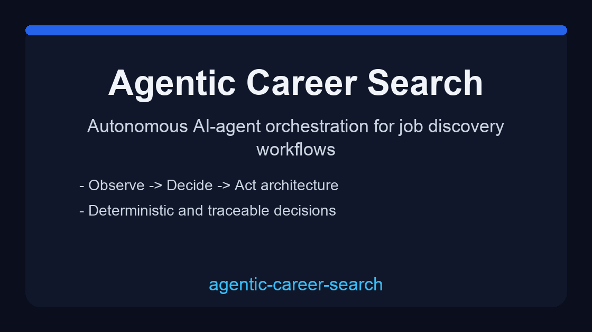
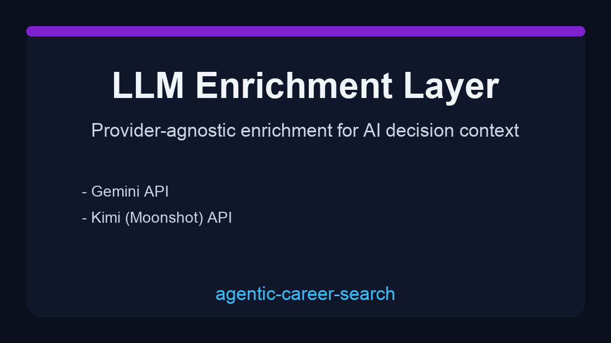
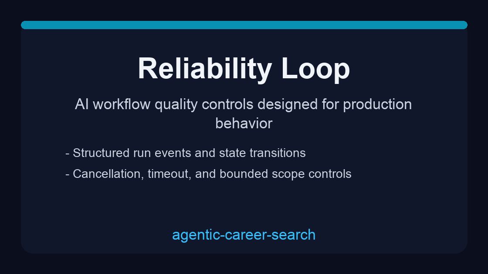

# agentic-career-search

   

AI-agent backend for autonomous job discovery, explainable decisions, and production-style operations.

## Demo Gallery







## Why this exists

Most job-search automation demos fail in real usage because they:
- cannot explain why a role is ranked highly,
- cannot recover cleanly when providers fail,
- have no durable event trace for debugging,
- become hard to maintain once features grow.

This project solves those issues with explicit agent engineering primitives:
- deterministic decision engine with rationale traces,
- state-machine run lifecycle and durable event log,
- tool/adapters abstraction for external integrations,
- safety controls (timeouts, bounded scope, cancellation),
- optional LLM enrichment via multiple providers.

## Real use cases (problem -> solution)

| Problem | Why it hurts | How this repo solves it |
|---|---|---|
| Teams can scrape jobs but cannot justify recommendations | Low trust from users and reviewers | `AgentDecisionEngine` stores score, matched terms, priority tier, and rationale |
| Background runs are hard to debug | Silent failures block iteration speed | Durable run events (`run.*`, `source.*`, `agent.*`) support replay-style troubleshooting |
| Vendor lock-in around one model provider | High migration cost and brittle integrations | Configurable LLM enrichment supports GPT-style, Claude, Gemini, and Kimi APIs |
| Model/API outages break the entire flow | System appears unreliable | Graceful fallback preserves deterministic baseline output when LLM enrichment is unavailable |
| Repo quality degrades over time | Contributors lose confidence | CI checks + daily automation loop maintain quality and push incremental improvements |

## LLM API integration (consumes model outputs)

Provider integration is built into the code path:
- Gemini API
- Kimi (Moonshot, OpenAI-compatible)
- Claude (Anthropic Messages API)
- GPT-compatible APIs through OpenAI-style endpoint patterns

Enable provider enrichment:

```env
LLM_ENABLE_ENRICHMENT=true
LLM_PROVIDER=gemini   # or kimi / claude
```

Then set matching API keys in `.env` (see `CONFIGURATION.md`).

## Engineering standards covered

This repository follows the requested standards:
1. standalone repo architecture (not coupled to source repo internals),
2. AI-agent-first design with deterministic decision traces,
3. LLM output consumption from Claude/Gemini/Kimi and GPT-style integrations,
4. production-minded layout (`src`, `tests`, `scripts`, CI, env config, migrations),
5. high-quality docs (`README`, `QUICKSTART`, `CONFIGURATION`, `SAFETY`, `ARCHITECTURE`),
6. branch-based merge workflow for controlled integration (no direct unsafe merges),
7. lint/type/test validation before finalization,
8. no Docker requirement for standard local verification,
9. phase branches for development roadmap (`phase/01` to `phase/10`),
10. commit-forward workflow with frequent incremental pushes.

## API snapshot

- `POST /source-configs` create source adapter configs
- `GET /source-configs` list enabled sources
- `POST /runs` enqueue autonomous run
- `GET /runs/{run_id}` inspect run state
- `GET /runs/{run_id}/events` inspect event timeline
- `POST /runs/{run_id}/cancel` request cancellation
- `GET /jobs` inspect normalized, scored, and enriched outputs
- `GET /health/live` and `GET /health/ready`

## Quick start

```bash
git clone https://github.com/Francis1998/agentic-career-search.git
cd agentic-career-search
uv venv
source .venv/bin/activate
uv sync --extra dev --frozen
cp .env.example .env
uv run uvicorn autoapply_agent.main:app --reload
```

## Documentation

| Document | Description |
|---|---|
| [ARCHITECTURE.md](ARCHITECTURE.md) | Core agent architecture and lifecycle |
| [CONFIGURATION.md](CONFIGURATION.md) | Runtime and provider configuration |
| [QUICKSTART.md](QUICKSTART.md) | Fast local setup and verification |
| [SAFETY.md](SAFETY.md) | Scope boundaries and operational guardrails |
| [docs/DEPLOYMENT.md](docs/DEPLOYMENT.md) | Deployment guidance |
| [docs/TROUBLESHOOTING.md](docs/TROUBLESHOOTING.md) | Common failure recovery paths |
| [CHANGELOG.md](CHANGELOG.md) | Release history |

## Regenerate demos

```bash
./scripts/generate_demo_gif.sh
```

## License

MIT © [Francis1998](https://github.com/Francis1998)
