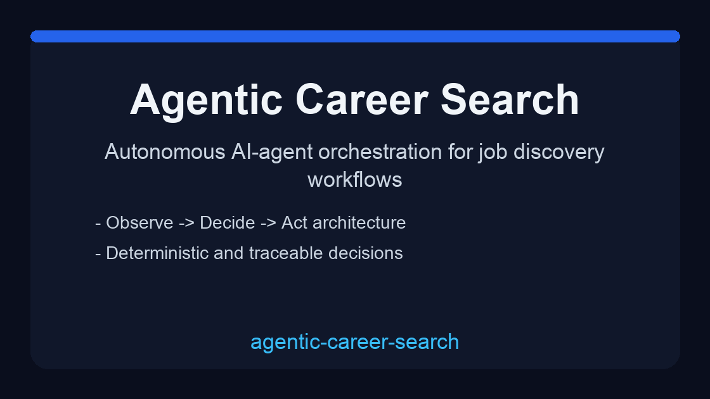
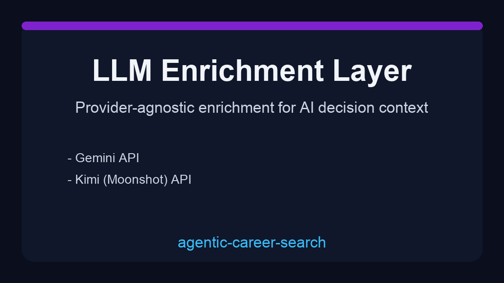
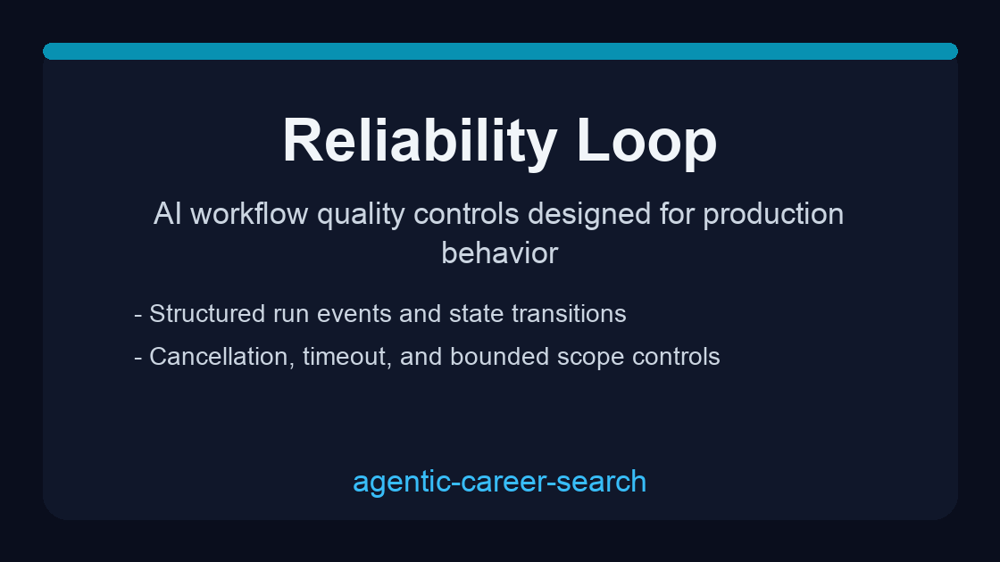
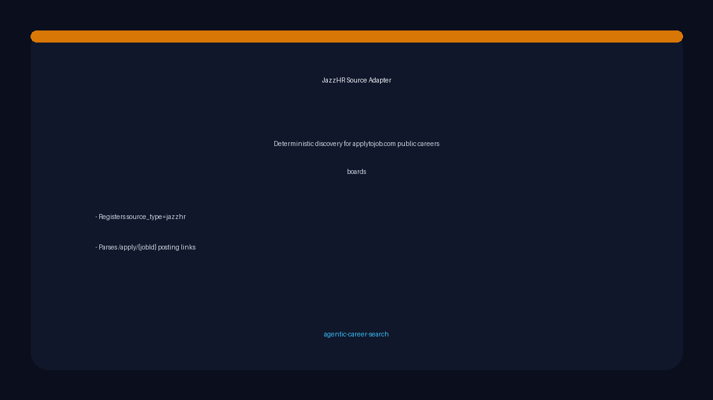
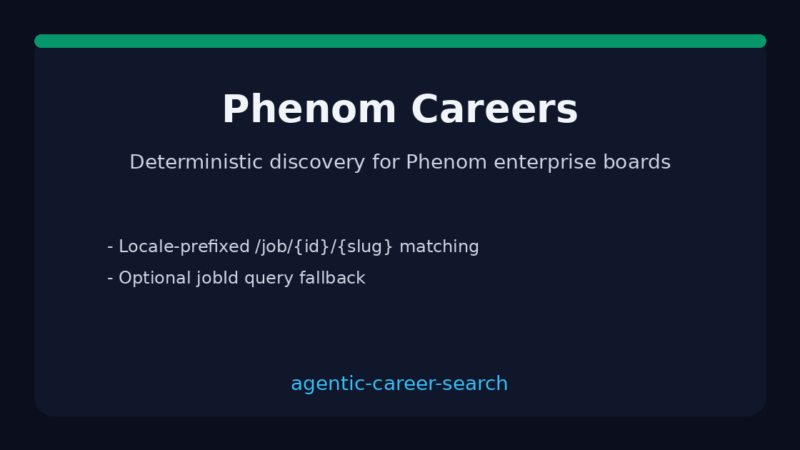

# agentic-career-search

   

AI-agent backend for autonomous job discovery, explainable decisions, and production-style operations.

## Demo Gallery











## Why this exists

Most job-search automation demos fail in real usage because they:
- cannot explain why a role is ranked highly,
- cannot recover cleanly when providers fail,
- have no durable event trace for debugging,
- become hard to maintain once features grow.

This project solves those issues with explicit agent engineering primitives:
- deterministic decision engine with rationale traces,
- state-machine run lifecycle and durable event log,
- tool/adapters abstraction for external integrations,
- safety controls (timeouts, bounded scope, cancellation),
- optional LLM enrichment via multiple providers.

## Real use cases (problem -> solution)

| Problem | Why it hurts | How this repo solves it |
|---|---|---|
| Teams can scrape jobs but cannot justify recommendations | Low trust from users and reviewers | `AgentDecisionEngine` stores score, matched terms, priority tier, and rationale |
| Background runs are hard to debug | Silent failures block iteration speed | Durable run events (`run.*`, `source.*`, `agent.*`) support replay-style troubleshooting |
| Vendor lock-in around one model provider | High migration cost and brittle integrations | Configurable LLM enrichment supports GPT-5.5, Claude Sonnet 4.6, Gemini 3.x, and Kimi K2-style APIs |
| Model/API outages break the entire flow | System appears unreliable | Graceful fallback preserves deterministic baseline output when LLM enrichment is unavailable |
| Repo quality degrades over time | Contributors lose confidence | CI checks + daily automation loop maintain quality and push incremental improvements |

## LLM API integration (consumes model outputs)

Provider integration is built into the code path:
- Gemini API
- Kimi (Moonshot, OpenAI-compatible)
- Claude (Anthropic Messages API)
- GPT-compatible APIs through OpenAI-style endpoint patterns

Enable provider enrichment:

```env
LLM_ENABLE_ENRICHMENT=true
LLM_PROVIDER=gemini   # or kimi / claude / gpt
```

Then set matching API keys in `.env` (see `CONFIGURATION.md`).

## Engineering standards covered

This repository follows the requested standards:
1. standalone repo architecture (not coupled to source repo internals),
2. AI-agent-first design with deterministic decision traces,
3. LLM output consumption from Claude/Gemini/Kimi and GPT-style integrations,
4. production-minded layout (`src`, `tests`, `scripts`, CI, env config, migrations),
5. high-quality docs (`README`, `QUICKSTART`, `CONFIGURATION`, `SAFETY`, `ARCHITECTURE`),
6. branch-based merge workflow for controlled integration (no direct unsafe merges),
7. lint/type/test validation before finalization,
8. no Docker requirement for standard local verification,
9. phase branches for development roadmap (`phase/01` to `phase/10`),
10. commit-forward workflow with frequent incremental pushes.

## API snapshot

- `POST /source-configs` create source adapter configs
- `GET /source-configs` list enabled sources
- `POST /runs` enqueue autonomous run
- `GET /runs/{run_id}` inspect run state
- `GET /runs/{run_id}/events` inspect event timeline
- `POST /runs/{run_id}/cancel` request cancellation
- `GET /jobs` inspect normalized, scored, and enriched outputs
- `GET /health/live` and `GET /health/ready`

## Supported job sources

Each `SourceConfig` selects a source adapter by `source_type`:

| `source_type` | Adapter | How it parses | Best for |
|---|---|---|---|
| `greenhouse` | `GreenhouseAdapter` | Scrapes `div.opening` anchors on public Greenhouse boards | Greenhouse-hosted boards |
| `lever` | `LeverAdapter` | Scrapes `div.posting` anchors on public Lever pages | Lever-hosted boards |
| `ashby` | `AshbyAdapter` | Recognises `jobs.ashbyhq.com/{org}/{uuid}` posting anchors by URL shape | Ashby-hosted boards |
| `workable` | `WorkableAdapter` | Recognises `apply.workable.com/{company}/j/{shortcode}` posting anchors by URL shape | Workable-hosted boards |
| `recruitee` | `RecruiteeAdapter` | Recognises `{company}.recruitee.com/o/{slug}` posting anchors by URL shape | Recruitee-hosted careers sites |
| `smartrecruiters` | `SmartRecruitersAdapter` | Recognises `jobs.smartrecruiters.com/{company}/{jobId}-{slug}` posting anchors by URL shape | SmartRecruiters-hosted careers sites |
| `teamtailor` | `TeamtailorAdapter` | Recognises `{company}.teamtailor.com/jobs/{jobId}-{slug}` posting anchors by URL shape | Teamtailor-hosted careers sites |
| `personio` | `PersonioAdapter` | Recognises `{tenant}.jobs.personio.de`/`.com/job/{jobId}` posting anchors by URL shape | Personio-hosted careers sites (DACH/EU) |
| `bamboohr` | `BambooHrAdapter` | Reads the public `{tenant}.bamboohr.com/careers/list` **JSON** board and maps each opening to `/careers/{id}` | BambooHR-hosted careers sites (SMB tech/healthcare/services) |
| `jobvite` | `JobviteAdapter` | Recognises `jobs.jobvite.com/{company}/job/{jobId}` posting anchors by URL shape (terminal singular `job`, alphanumeric id) | Jobvite-hosted careers sites |
| `icims` | `IcimsAdapter` | Recognises `careers-{tenant}.icims.com/jobs/{jobId}/{slug}/job` posting anchors by URL shape (terminal literal `job`, numeric id; slug optional) | iCIMS-hosted careers portals (enterprise) and vanity-domain proxies |
| `workday` | `WorkdayAdapter` | POSTs the public `{tenant}.wd{N}.myworkdayjobs.com/wday/cxs/{tenant}/{site}/jobs` **JSON** CXS board (page size 20) and maps each posting to `{origin}/{locale}/{site}{externalPath}` | Workday-hosted enterprise careers sites |
| `oracle_taleo` | `OracleTaleoAdapter` | Recognises Taleo/Oracle Cloud posting anchors via `job=` query ids or terminal `/job/{id}` / `/jobs/{id}` path shapes | Oracle Taleo (`*.taleo.net`) and Oracle Cloud HCM careers portals |
| `successfactors` | `SuccessFactorsAdapter` | Recognises SuccessFactors posting anchors via `jobId` / `career_job_req_id` query ids or terminal `/job/{id}` / `/jobs/{id}` path shapes | SAP SuccessFactors (`*.successfactors.com` / `*.successfactors.eu`) careers portals |
| `zoho_recruit` | `ZohoRecruitAdapter` | Recognises Zoho Recruit posting anchors via `jobId` / `jid` / `job_id` query ids or terminal `/job/{id}` / `/jobs/{id}` / `/careers/{id}` path shapes | Zoho Recruit (`*.zohorecruit.com`) careers portals and vanity-domain proxies |
| `jazzhr` | `JazzHrAdapter` | Recognises JazzHR posting anchors via `/apply/{jobId}` or `/apply/{jobId}/{slug}` path shapes | JazzHR (`*.applytojob.com/apply`) careers portals and vanity-domain proxies |
| `breezyhr` | `BreezyHrAdapter` | Recognises `{company}.breezy.hr/p/{positionId}` posting anchors by URL shape (terminal `p`, alphanumeric id; slug optional) | Breezy HR-hosted careers sites (startup/SMB) |
| `freshteam` | `FreshteamAdapter` | Recognises Freshteam careers posting anchors by job URL shape | Freshworks Freshteam-hosted careers boards |
| `phenom` | `PhenomPeopleAdapter` | Recognises Phenom posting anchors via `/job/{jobId}/{slug}` or `/jobs/{jobId}` path shapes, rejecting list/index/login/apply-step links | Phenom People-hosted enterprise and branded careers sites |
| `rippling` | `RipplingAdapter` | Recognises Rippling posting anchors via terminal `/jobs/{uuid}` paths on `*.rippling.com` domains | Rippling-hosted public careers boards |
| `pinpoint` | `PinpointAdapter` | Recognises Pinpoint HR careers posting anchors by `/postings/{uuid}` or `/jobs/{id}` URL shape | Pinpoint (`*.pinpointhq.com`) careers boards |
| `comeet` | `ComeetAdapter` | Recognises Comeet careers posting anchors by `/jobs/{company}/{companyId}/{jobSlug}/{jobId}` URL shape | Comeet (`www.comeet.co` / `www.comeet.com`) careers boards |
| `fountain` | `FountainAdapter` | Recognises Fountain careers posting anchors by `/apply/{company}/{positionId}`, `/apply/{slug}`, `/jobs/{id}`, `/openings/{id}`, or `/positions/{id}` URL shape | Fountain (`*.fountain.com`, `web.fountain.com`) careers boards |
| `gem` | `GemAdapter` | Recognises Gem careers posting anchors by `jobs.gem.com/{company}/{jobId}`, `/jobs/{jobId}`, `/openings/{id}`, or `{company}.gem.com/careers/...` URL shapes | Gem (`jobs.gem.com` / `*.gem.com`) careers boards |
| `avature` | `AvatureAdapter` | Recognises Avature careers posting anchors by `/JobDetail/{id}`, `/JobDetail.aspx?JobId={id}`, `/careers/{id}`, `/careers/job/{id}`, `/careers/VacancyDetail/{id}`, `/Vacancy/{id}`, or `/vacancies/{id}` URL shapes | Avature-hosted public careers portals |
| `eightfold` | `EightfoldAdapter` | Recognises Eightfold careers posting anchors by `/careers/job/{id}`, `/careers/job/{id}/{slug}`, `/career_detail/{id}`, `/position/{id}`, or `/jobs/{id}` URL shapes | Eightfold (`*.eightfold.ai`) careers boards |
| `jobscore` | `JobScoreAdapter` | Recognises JobScore careers posting anchors by `/careers/{company}/jobs/{slug}-{id}`, `/careers/{company}/jobs/{id}`, `/jobs/{id}`, `/jobs/{slug}/{id}`, or `/position(s)/{id}` URL shapes | JobScore (`careers.jobscore.com` / `*.jobscore.com`) careers boards |
| `hireology` | `HireologyAdapter` | Recognises Hireology careers posting anchors by `/jobs/{id}`, `/careers/job/{id}`, or `/job/{id}/{slug}` URL shapes | Hireology (`careers.hireology.com`) careers boards |
| `dayforce` | `DayforceAdapter` | Recognises Dayforce careers posting anchors by `/JobDetail/{id}`, `/careers/job/{id}`, `/MyCareer/JobDetail?jobId={id}`, or `/positions/{id}` URL shapes | Dayforce (`*.dayforcehcm.com`) careers boards |
| `homerun` | `HomerunAdapter` | Recognises Homerun careers posting anchors by `/jobs/{id}-{slug}`, `/o/{id}`, or `/vacancies/{id}` URL shapes | Homerun (`*.homerun.co`) careers boards |
| `clearcompany` | `ClearCompanyAdapter` | Recognises ClearCompany careers posting anchors by `/careers/job/{id}`, `/careers/{id}`, `/jobs/{id}`, `/job/{id}-{slug}`, or `/position/{id}` URL shapes | ClearCompany (`*.clearcompany.com`) careers boards |
| `applied` | `AppliedAdapter` | Recognises Applied careers posting anchors by `/jobs/{id}`, `/j/{id}`, `/role/{id}`, `/roles/{id}`, or `/job/{id}` URL shapes | Applied (`*.applied.co`) careers boards || `jsonld` | `JsonLdAdapter` | Reads embedded `schema.org/JobPosting` JSON-LD | **Any** board emitting Google-Jobs structured data (SmartRecruiters, custom career sites, ...) |
| `recruiterflow` | `RecruiterflowAdapter` | Recognises Recruiterflow careers posting anchors by `/jobs/{id}`, `/job/{id}`, `/careers/job/{id}`, `/openings/{id}`, or `/opening/{id}` URL shapes | Recruiterflow (`*.recruiterflow.com`) careers boards |
| `manatal` | `ManatalAdapter` | Recognises Manatal careers posting anchors by `/jobs/{id}`, `/job/{id}`, `/careers/{id}`, `/careers/job/{id}`, or `/openings/{id}` URL shapes | Manatal (`*.manatal.com`) careers boards |
| `join` | `JoinAdapter` | Recognises Join careers posting anchors by `/companies/{slug}/jobs/{id}`, `/jobs/{id}`, `/job/{id}`, or `/positions/{id}` URL shapes | Join (`join.com`) careers boards |
| `softgarden` | `SoftgardenAdapter` | Recognises Softgarden careers posting anchors by `/job/{id}`, `/jobs/{id}`, `/vacancies/{id}`, `/vacancy/{id}`, or `/position/{id}` URL shapes | Softgarden (`*.softgarden.io`) careers boards |
| `factorial` | `FactorialAdapter` | Recognises Factorial HR careers posting anchors by `/jobs/{id}`, `/job/{id}`, `/careers/{id}`, `/careers/job/{id}`, or `/open-positions/{id}` URL shapes | Factorial (`*.factorialhr.com`) careers boards |
| `ukg` | `UkgAdapter` | Recognises UKG/UltiPro careers posting anchors by `/jobs/{id}`, `/job/{id}`, `/opportunities/{id}`, `/opportunity/{id}`, or `/careers/job/{id}` URL shapes | UKG (`*.ultipro.com` / `*.ukg.net`) careers boards |
| `bullhorn` | `BullhornAdapter` | Recognises Bullhorn careers posting anchors by `/jobs/{id}`, `/Job/{id}`, `/careers/{id}`, `/careers/job/{id}`, or `/position/{id}` URL shapes | Bullhorn (`*.bullhornstaffing.com`) careers boards |
| `paylocity` | `PaylocityAdapter` | Recognises Paylocity careers posting anchors by `/jobs/{id}`, `/JobDetails/{id}`, `/careers/{id}`, `/careers/job/{id}`, or `/openings/{id}` URL shapes | Paylocity (`*.paylocity.com`) careers boards |
| `polymer` | `PolymerAdapter` | Recognises Polymer careers posting anchors by `/jobs/{id}`, `/job/{id}`, `/careers/{id}`, `/careers/job/{id}`, or `/positions/{id}` URL shapes | Polymer (`*.polymer.co`) careers boards |
| `jobadder` | `JobAdderAdapter` | Recognises JobAdder careers posting anchors by `/jobs/{id}`, `/job/{id}`, `/careers/{id}`, `/careers/job/{id}`, or `/position/{id}` URL shapes | JobAdder (`*.jobadder.com`) careers boards |
| `dover` | `DoverAdapter` | Recognises Dover careers posting anchors by `/jobs/{id}`, `/job/{id}`, `/careers/{id}`, `/careers/job/{id}`, or `/openings/{id}` URL shapes | Dover (`app.dover.com`) careers boards |
| `loxo` | `LoxoAdapter` | Recognises Loxo careers posting anchors by `/jobs/{id}`, `/job/{id}`, `/positions/{id}`, `/careers/{id}`, or `/careers/job/{id}` URL shapes | Loxo (`*.loxo.co`) careers boards |
| `jsonld` | `JsonLdAdapter` | Reads embedded `schema.org/JobPosting` JSON-LD | **Any** board emitting Google-Jobs structured data (SmartRecruiters, custom career sites, ...) |
| `hibob` | `HibobAdapter` | Recognises HiBob careers posting anchors by `/jobs/{id}`, `/job/{id}`, `/careers/{id}`, `/careers/job/{id}`, or `/positions/{id}` URL shapes | HiBob (`*.hibob.com`) / Bob careers boards |

Unlike the HTML-scraping adapters, `bamboohr` and `workday` are structured-JSON
sources: BambooHR and Workday careers pages are client-rendered apps, so those
adapters read the tenant's public JSON listing endpoints directly (stable titles,
locations, and ids) instead of parsing rendered markup. Workday uses the public
CXS POST API — see [`docs/guides/WORKDAY_SOURCE_GUIDE.md`](docs/guides/WORKDAY_SOURCE_GUIDE.md).

The `jsonld` adapter is vendor-neutral: modern ATS platforms publish
`<script type="application/ld+json">` `JobPosting` payloads so their roles appear
in Google Jobs, so a single adapter covers boards that would otherwise each need
a bespoke scraper. It understands bare objects, arrays, `@graph`/`ItemList`
containers, `TELECOMMUTE` remote roles, and `PropertyValue` identifiers, and it
skips malformed blocks instead of failing the whole page.

```bash
# Register a JSON-LD source
curl -X POST localhost:8000/source-configs \
  -H 'content-type: application/json' \
  -d '{"name":"acme-careers","source_type":"jsonld","base_url":"https://acme.example.com/careers"}'
```

## Quick start

```bash
git clone https://github.com/Francis1998/agentic-career-search.git
cd agentic-career-search
uv venv
source .venv/bin/activate
uv sync --extra dev --frozen
cp .env.example .env
uv run uvicorn autoapply_agent.main:app --reload
```

## Documentation

| Document | Description |
|---|---|
| [ARCHITECTURE.md](ARCHITECTURE.md) | Core agent architecture and lifecycle |
| [CONFIGURATION.md](CONFIGURATION.md) | Runtime and provider configuration |
| [QUICKSTART.md](QUICKSTART.md) | Fast local setup and verification |
| [SAFETY.md](SAFETY.md) | Scope boundaries and operational guardrails |
| [docs/DEPLOYMENT.md](docs/DEPLOYMENT.md) | Deployment guidance |
| [docs/TROUBLESHOOTING.md](docs/TROUBLESHOOTING.md) | Common failure recovery paths |
| [CHANGELOG.md](CHANGELOG.md) | Release history |

## Regenerate demos

```bash
./scripts/generate_demo_gif.sh
```

## License

MIT © [Francis1998](https://github.com/Francis1998)
