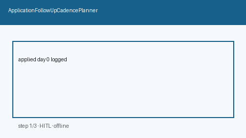

# Application Follow-Up Cadence Guide



Build deterministic, offline **post-apply follow-up cadences** from `applied_on` +
preferred channels. Never auto-nudges recruiters. Closes the gap vs Teal/Huntr CRM
reminders that hide schedules inside proprietary UIs.

Optional later polish via **GPT-5.5 / Claude Sonnet 4.6 / Gemini 3.x / Kimi K2**.
Cadence assembly itself stays deterministic.

Distinct from `ApplicationGhostingDetector` (stall urgency) and
`RecruiterOutreachDraftService` (cold outreach drafts).

## Why this exists

After applying, candidates need a local day-offset checklist — not a one-click
auto-nudge. Closed trackers show reminders, but few open-source career agents
expose an offline cadence with explicit human-review gates.

## Usage

```python
from autoapply_agent.services.followup_cadence import ApplicationFollowUpCadencePlanner

plan = ApplicationFollowUpCadencePlanner().plan(
    company="Acme",
    role="Backend Engineer",
    applied_on="2026-09-14",
    channels=["email", "linkedin"],
)
assert plan.requires_human_review is True
assert plan.auto_nudge is False
print(plan.steps)
print(plan.guidance)
```

## Safety

Always `requires_human_review=True` and `auto_nudge=False`. No HTTP. Humans decide
whether to send any follow-up. See `SAFETY.md`.
