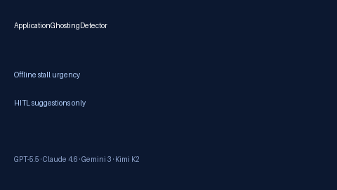

# Application Ghosting Detector Guide



Generate deterministic, offline **stalled-application urgency and HITL follow-up
suggestions**. Never auto-nudges recruiters. Closes the gap vs Teal/Huntr CRM
"no reply" views that stay locked inside proprietary UIs.

Optional later polish via **GPT-5.5 / Claude Sonnet 4.6 / Gemini 3.x / Kimi K2**.
The stall math itself stays deterministic.

## Why this exists

Teal and Huntr show quiet applications, but few open-source career agents expose
a local ghosting detector with explicit urgency and human-review suggestions.
This service always sets `requires_human_review=True`, keeps `auto_nudge=False`,
and performs no network I/O.

## Usage

```python
from autoapply_agent.services.application_ghosting import ApplicationGhostingDetector

status = ApplicationGhostingDetector().detect(
    company="Acme",
    role="Platform Engineer",
    stage="applied",
    last_update_iso="2026-08-20",
    now_iso="2026-09-12",
)
assert status.requires_human_review is True
assert status.auto_nudge is False
print(status.days_stalled, status.urgency)
print(status.suggestions)
```

Urgency values: `fresh` (<7d), `cooling` (7–13d), `stalled` (14–20d),
`likely_ghosted` (21d+). Interview/onsite/final stages apply a +3 day bias.

## Safety

Always `requires_human_review=True` and `auto_nudge=False`. No HTTP. Humans
decide whether to follow up manually. See `SAFETY.md`.
