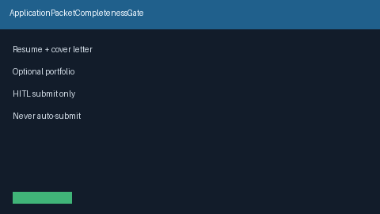

# Application Packet Completeness Gate Guide



Validate resume / cover letter / optional portfolio before human submit.
Never auto-submits. Closes the Teal / Huntr / Simplify packet-checklist gap.

Optional later polish via **GPT-5.5 / Claude Sonnet 4.6 / Gemini 3.x / Kimi K2**.

Distinct from `ApplicationDraftService` and `AtsKeywordCoverageScorer`.

## Usage

```python
from autoapply_agent.services.packet_completeness import ApplicationPacketCompletenessGate

report = ApplicationPacketCompletenessGate().evaluate(
    resume_text="Backend engineer resume",
    cover_letter_text="Excited about the role",
)
assert report.auto_submit is False
assert report.ready_for_human_submit is True
print(report.completeness_score, report.missing_required)
```

## Safety

Always `requires_human_review=True` and `auto_submit=False`. No HTTP. Humans
submit packets. See `SAFETY.md`.
