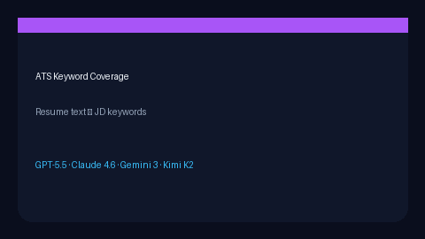

# ATS Keyword Coverage Scorer Guide



Measure how many distinctive job-description keywords appear in free-form
resume text. This is the classic ATS keyword-coverage loop (Teal / Jobscan
style) as a library API — **not** the skills-list fit scorer.

Optional later polish via **GPT-5.5 / Claude Sonnet 4.6 / Gemini 3.x / Kimi K2**.
The scorer itself stays deterministic.

## Why this exists

Teal and Jobscan show keyword coverage in a UI. `SkillsProfileFitScorer` matches
an explicit skills *list*. JobSpy returns postings without resume↔JD coverage.
This scorer extracts ranked JD keywords and scores resume token coverage for
agentic triage.

## Usage

```python
from autoapply_agent.services.ats_keyword_coverage import (
    AtsKeywordCoverageScorer,
    score_keyword_coverage,
)

result = score_keyword_coverage(
    "Built Python FastAPI services on Kubernetes",
    "Looking for a Python FastAPI Kubernetes engineer with Go",
)
print(result.coverage_score)
print(result.present_keywords)
print(result.missing_keywords)

scorer = AtsKeywordCoverageScorer(top_k=20)
assert scorer.score("python redis", "Python Redis Kafka") == score_keyword_coverage(
    "python redis", "Python Redis Kafka", top_k=20
)
```

## Distinct from SkillsProfileFitScorer

| Scorer | Input | Match style |
|---|---|---|
| `SkillsProfileFitScorer` | Candidate skills **list** | Each skill token in JD |
| `AtsKeywordCoverageScorer` | Free-form **resume text** | JD keywords present in resume |

## Edge cases

| Input | Result |
|---|---|
| Empty JD | `coverage_score=0.0` |
| Full overlap | `coverage_score=1.0` |
| Stopwords only | No JD keywords → 0.0 |

See `SAFETY.md` — scoring is assistive triage, not automatic apply.
