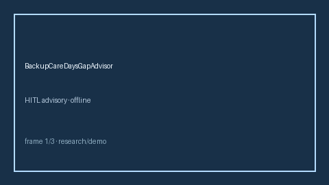

# BackupCareDaysGapAdvisor Guide



Offline HITL advisor. Never auto-acts. Closes closed-UI gaps vs Bright Horizons/Care.com/Levels.fyi backup-care day planners.

Optional later polish via **GPT-5.5 / Claude Sonnet 4.6 / Gemini 3.x / Kimi K2**.

Distinct from `DependentCareFsaGapAdvisor` and `ParentalLeaveGapAdvisor`.

## Usage

```python
from autoapply_agent.services.backup_care_days_gap import BackupCareDaysGapAdvisor

report = BackupCareDaysGapAdvisor().advise(
    needed_backup_days=1800.0,
    employer_backup_days=1200.0,
    planned_use_days=1200.0,
)
assert report.auto_claim is False
assert report.requires_human_review is True
print(report.coverage_band, report.remaining_cap_days)
```

## Safety

Always `requires_human_review=True`. No HTTP. Humans decide. See `SAFETY.md`.
