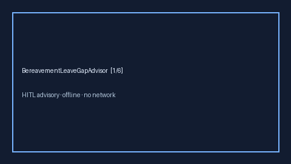

# BereavementLeaveGapAdvisor Guide



Offline HITL advisor. Never auto-approves. Closes closed-UI gaps vs Lattice /
Workday / Levels.fyi bereavement-leave planners.

Optional later polish via **GPT-5.5 / Claude Sonnet 4.6 / Gemini 3.x / Kimi K2**.

Distinct from `ParentalLeaveGapAdvisor` and `SabbaticalEligibilityAdvisor`.

## Usage

```python
from autoapply_agent.services.bereavement_leave_gap import BereavementLeaveGapAdvisor

report = BereavementLeaveGapAdvisor().advise(offered_days=3.0, needed_days=5.0)
assert report.auto_approve is False
assert report.requires_human_review is True
print(report.coverage_band, report.coverage_ratio)
```

## Safety

Always `requires_human_review=True`. No HTTP. Humans decide. See `SAFETY.md`.
