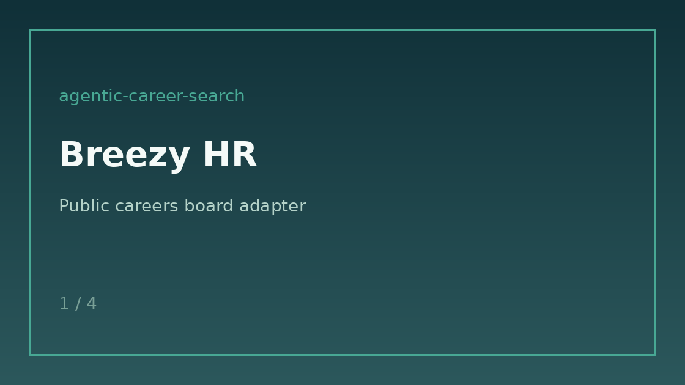

# Breezy HR Source Guide



Use this guide when wiring a public Breezy HR careers board into
**agentic-career-search**. Discovery is deterministic HTML URL-shape matching —
enrichment with GPT-5.5 / Claude Sonnet 4.6 / Gemini 2.5 / Kimi K2 is optional
and runs after candidates are collected.

## Why Breezy HR

Breezy HR (`{company}.breezy.hr`) is a popular ATS for startups and SMBs that is
still missing from many open job-search stacks. Public boards expose each
position as an anchor under `/p/{positionId}` (optionally with a hyphenated
title slug). This adapter mirrors the Teamtailor/Personio/Jobvite URL-shape
approach used for other HTML careers sources.

## Register a source

```bash
curl -X POST localhost:8000/source-configs \
  -H 'content-type: application/json' \
  -d '{
    "name": "acme-breezy",
    "source_type": "breezyhr",
    "base_url": "https://acme.breezy.hr/"
  }'
```

Any public listing URL for the tenant works. The adapter extracts postings from:

| Shape | Example |
|---|---|
| Position id | `/p/8f092b537498` |
| Position id + slug | `/p/a1b2c3d4e5f6-product-manager` |

Apply steps (`/p/{positionId}/apply`) and board navigation links are ignored.

## What you get

| Field | Source |
|---|---|
| `title` | Anchor text, else `title` attribute |
| `location` | Nearest posting-container location text |
| `external_id` | Terminal `/p/{positionId}` token |
| `url` | Absolute posting URL |
| `company` | Host-derived token |

## Safety notes

- Public careers pages only — no authenticated Breezy APIs.
- Outbound User-Agent comes from settings.
- Parsing stops at `max_jobs`; no unbounded crawl.

See ADR-091 for the design decision.
