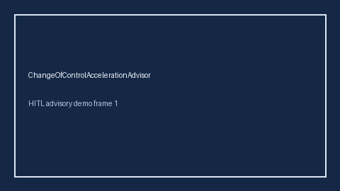

# ChangeOfControlAccelerationAdvisor Guide



Offline HITL advisor. Never auto-acts. Closes closed-UI gaps vs Carta/Levels.fyi/Blind change-of-control / double-trigger acceleration planners.

Optional later polish via **GPT-5.5 / Claude Sonnet 4.6 / Gemini 3.x / Kimi K2**.

Distinct from `EquityVestingCliffAdvisor` and `SigningBonusClawbackAdvisor`.

## Usage

```python
from autoapply_agent.services.change_of_control_acceleration import ChangeOfControlAccelerationAdvisor

report = ChangeOfControlAccelerationAdvisor().advise(
    accelerated_pct=10.0,
    target_accelerated_pct=7.0,
)
assert report.auto_enroll is False
print(report.coverage_band)
```

## Safety

Always `requires_human_review=True`. No HTTP. Humans decide. See `SAFETY.md`.
