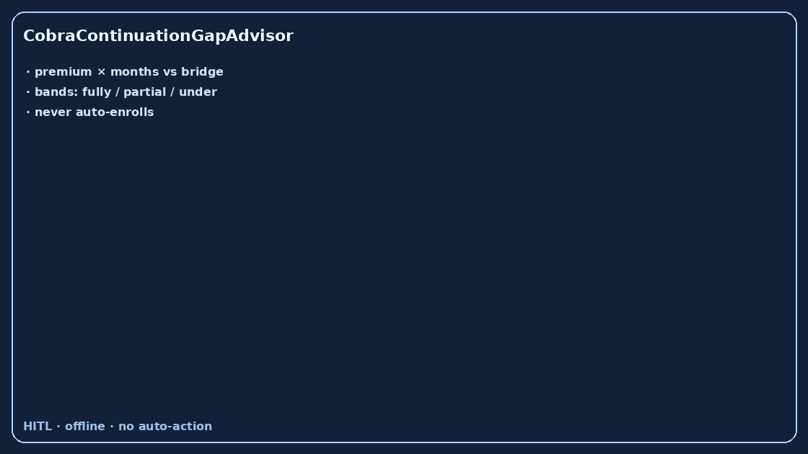

# CobraContinuationGapAdvisor Guide



Offline HITL advisor. Never auto-enrolls. Closes closed-UI gaps vs Fidelity /
HealthEquity / Levels.fyi COBRA premium planners.

Optional later polish via **GPT-5.5 / Claude Sonnet 4.6 / Gemini 3.x / Kimi K2**.

Distinct from `SeverancePackageGapAdvisor` and `HsaContributionGapAdvisor`.

## Usage

```python
from autoapply_agent.services.cobra_continuation_gap import CobraContinuationGapAdvisor

report = CobraContinuationGapAdvisor().advise(
    monthly_premium_usd=700.0,
    months_needed=6,
    bridge_months_funded=4.0,
)
assert report.auto_enroll is False
assert report.requires_human_review is True
print(report.coverage_band, report.total_cobra_cost_usd)
```

## Safety

Always `requires_human_review=True`. No HTTP. Humans decide. See `SAFETY.md`.
