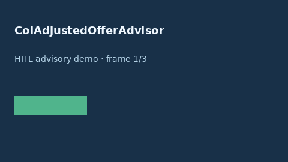

# ColAdjustedOfferAdvisor Guide



Offline HITL advisor. Never auto-acts. Closes closed-UI gaps vs Levels.fyi/NerdWallet/Blind COL-adjusted offer planners.

Optional later polish via **GPT-5.5 / Claude Sonnet 4.6 / Gemini 3.x / Kimi K2**.

Distinct from `OfferCompareService` and `SalaryBandAdvisor`.

## Usage

```python
from autoapply_agent.services.col_adjusted_offer import ColAdjustedOfferAdvisor

report = ColAdjustedOfferAdvisor().advise(
    offer_usd=80.0,
    col_adjusted_target_usd=50.0,
)
assert report.auto_enroll is False
print(report.coverage_band)
```

## Safety

Always `requires_human_review=True`. No HTTP. Humans decide. See `SAFETY.md`.
