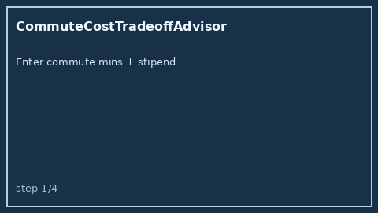

# CommuteCostTradeoffAdvisor Guide



Offline HITL advisor. Never auto-accepts. Closes closed-UI gaps vs Blind /
Levels.fyi / RemoteOK commute vs stipend math.

Optional later polish via **GPT-5.5 / Claude Sonnet 4.6 / Gemini 3.x / Kimi K2**.

Distinct from `RemoteTimezoneOverlapAdvisor` and `RelocationPackageGapAdvisor`.

## Usage

```python
from autoapply_agent.services.commute_cost_tradeoff import CommuteCostTradeoffAdvisor

report = CommuteCostTradeoffAdvisor().advise(
    commute_minutes_one_way=40.0,
    office_days_per_week=3.0,
    hourly_time_value=50.0,
    weekly_transit_cost=40.0,
    remote_stipend_monthly=250.0,
)
assert report.auto_accept is False
assert report.requires_human_review is True
print(report.tradeoff_band, report.net_delta_usd)
```

## Safety

Always `requires_human_review=True`. No HTTP. Humans decide. See `SAFETY.md`.
