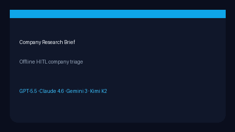

# Company Research Brief Guide



Generate a deterministic, offline company brief for human review before
outreach. Extracts light JD signals (remote, fintech, AI, …) and produces
talking points + open questions. Never fetches the network.

Optional later polish via **GPT-5.5 / Claude Sonnet 4.6 / Gemini 3.x / Kimi K2**.
The brief itself stays deterministic.

## Why this exists

Teal and Levels.fyi company pages are UI-bound. OpenHands agents invent company
facts without a stable structure. This service closes the gap with a testable
HITL brief primitive for agentic career triage.

## Usage

```python
from autoapply_agent.services.company_research import CompanyResearchBriefService

brief = CompanyResearchBriefService().generate(
    company="Nimbus",
    job_title="ML Engineer",
    job_text="Remote AI fintech platform hiring ML engineers",
)
assert brief.requires_human_review is True
print(brief.one_liner)
print(brief.jd_signals)
print(brief.talking_points)
print(brief.open_questions)
```

## Safety

Always `requires_human_review=True`. No HTTP. Humans verify before outreach.
See `SAFETY.md`.
