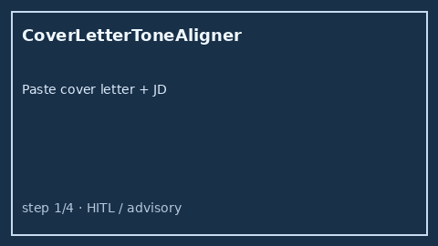

# Cover Letter Tone Aligner Guide



Align offline cover-letter tone bands (formal / energetic / collaborative /
technical) to JD culture and pace cues. Never auto-sends. Closes the Teal /
Rezi / Kickresume tone-matcher gap.

Optional later polish via **GPT-5.5 / Claude Sonnet 4.6 / Gemini 3.x / Kimi K2**.

Distinct from `JdCultureSignalExtractor` and `RecruiterOutreachDraftService`.

## Usage

```python
from autoapply_agent.services.cover_letter_tone import CoverLetterToneAligner

report = CoverLetterToneAligner().align(
    "I am excited and passionate about shipping with your team.",
    "We are a fast-paced startup that likes to move fast.",
)
assert report.requires_human_review is True
assert report.auto_send is False
print(report.alignment_score, report.missing_jd_bands)
```

## Safety

Always `requires_human_review=True` and `auto_send=False`. No HTTP. Humans edit
and send letters. See `SAFETY.md`.
