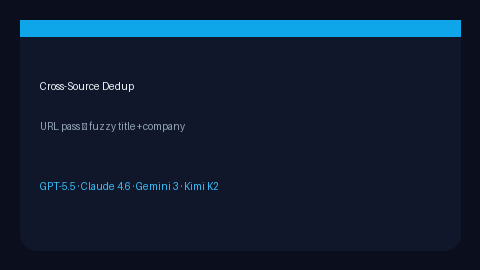

# Cross-Source Job Deduper Guide



Collapse the same role mirrored across Indeed, LinkedIn, Greenhouse, and other
boards when URLs differ but title+company are near-duplicates. Pass 1 is exact
URL; Pass 2 uses ``difflib`` SequenceMatcher on normalized title+company keys.

Optional later polish via **GPT-5.5 / Claude Sonnet 4.6 / Gemini 3.x / Kimi K2**.
The deduper itself stays deterministic and offline.

## Why this exists

JobSpy and board scrapers return raw postings; Teal/Simplify UI triage still
leaves duplicates when the same req appears under different URLs. OpenHands
agents can reason ad hoc about duplicates but lack a stable, testable
cross-source cluster primitive. This module closes that gap for agentic triage.

## Usage

```python
from dataclasses import dataclass
from autoapply_agent.services.cross_source_dedup import CrossSourceJobDeduper

@dataclass(frozen=True)
class Job:
    title: str
    company: str | None
    url: str

jobs = [
    Job("Senior SWE", "Acme Inc", "https://indeed.com/a"),
    Job("Senior SWE", "Acme", "https://linkedin.com/b"),
    Job("Data Scientist", "Beta", "https://gh.io/c"),
]
deduper = CrossSourceJobDeduper(threshold=0.85)
result = deduper.dedupe(jobs)
print(result.kept_indices)   # (0, 2)
print(result.dropped_count)  # 1
kept = deduper.keep(jobs)    # canonical Job objects
```

## Distinct from URL-only worker dedup

`services/worker.py` already skips identical URLs before insert. This deduper
handles **cross-source near-duplicates** where URLs differ. Use it before
ranking or CRM upsert.

## Edge cases

| Input | Result |
|---|---|
| Empty list | Empty kept / clusters |
| Same URL twice | Keep first |
| Same title, different company | Keep both |
| Near-identical title+company | Cluster; keep earliest |

See `SAFETY.md` — dedup is assistive triage, not automatic apply.
