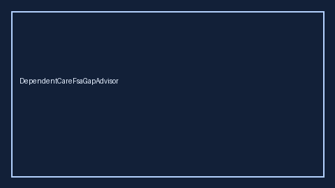

# DependentCareFsaGapAdvisor Guide



Offline HITL advisor. Never auto-enrolls. Closes closed-UI gaps vs WageWorks / Fidelity / Levels.fyi Dependent Care FSA planners.

Optional later polish via **GPT-5.5 / Claude Sonnet 4.6 / Gemini 3.x / Kimi K2**.

Distinct from `HsaContributionGapAdvisor` and `FertilityBenefitGapAdvisor`.

## Usage

```python
from autoapply_agent.services.dependent_care_fsa_gap import DependentCareFsaGapAdvisor

report = DependentCareFsaGapAdvisor().advise(
    annual_daycare_usd=12000.0,
    dcfsa_limit_usd=5000.0,
    planned_contribution_usd=5000.0,
)
assert report.auto_enroll is False
assert report.requires_human_review is True
print(report.coverage_band, report.remaining_cap_usd)
```

## Safety

Always `requires_human_review=True`. No HTTP. Humans decide. See `SAFETY.md`.
