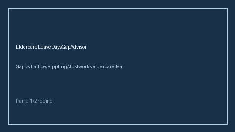

# EldercareLeaveDaysGapAdvisor Guide



Offline HITL advisor. Never auto-acts. Closes closed-UI gaps vs Lattice/Rippling/Justworks eldercare leave planners.

Optional later polish via **GPT-5.5 / Claude Sonnet 4.6 / Gemini 3.x / Kimi K2**.

Distinct from `ParentalLeaveGapAdvisor` and `PaidFamilyLeaveStateGapAdvisor`.

## Usage

```python
from autoapply_agent.services.eldercare_leave_days_gap import EldercareLeaveDaysGapAdvisor

report = EldercareLeaveDaysGapAdvisor().advise(
    offered_days=80.0,
    needed_days=50.0,
)
assert report.auto_enroll is False
print(report.coverage_band)
```

## Safety

Always `requires_human_review=True`. No HTTP. Humans decide. See `SAFETY.md`.
