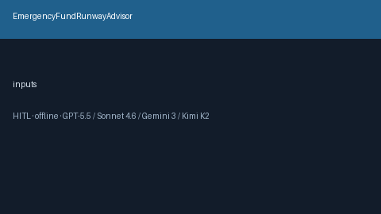

# EmergencyFundRunwayAdvisor Guide



Offline HITL advisor. Never auto-acts. Closes closed-UI gaps vs YNAB/Mint/Levels.fyi emergency-fund runway planners.

Optional later polish via **GPT-5.5 / Claude Sonnet 4.6 / Gemini 3.x / Kimi K2**.

Distinct from `CobraContinuationGapAdvisor and SeverancePackageGapAdvisor`.

## Usage

```python
from autoapply_agent.services.emergency_fund_runway import EmergencyFundRunwayAdvisor

report = EmergencyFundRunwayAdvisor().advise(
    liquid_savings_usd=12000.0,
    monthly_burn_usd=3000.0,
    target_months=6.0,
)
assert report.auto_enroll is False
assert report.requires_human_review is True
print(report.coverage_band)
```

## Safety

Always `requires_human_review=True`. No HTTP. Humans decide. See `SAFETY.md`.
