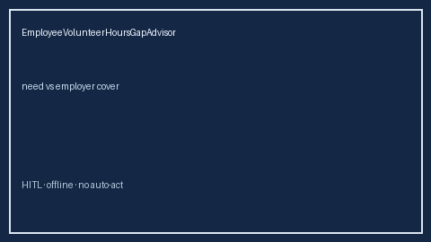

# EmployeeVolunteerHoursGapAdvisor Guide



Offline HITL advisor. Never auto-acts. Closes closed-UI gaps vs Benevity/VolunteerMatch/Levels.fyi/Blind volunteer-hours planners.

Optional later polish via **GPT-5.5 / Claude Sonnet 4.6 / Gemini 3.x / Kimi K2**.

Distinct from `BackupCareDaysGapAdvisor` and `WellnessStipendGapAdvisor`.

## Usage

```python
from autoapply_agent.services.employee_volunteer_hours_gap import EmployeeVolunteerHoursGapAdvisor

report = EmployeeVolunteerHoursGapAdvisor().advise(
    needed_hours_per_year=1800.0,
    employer_volunteer_hours=1200.0,
    planned_hours=1200.0,
)
assert report.auto_log is False
assert report.requires_human_review is True
print(report.coverage_band, report.remaining_cap)
```

## Safety

Always `requires_human_review=True`. No HTTP. Humans decide. See `SAFETY.md`.
