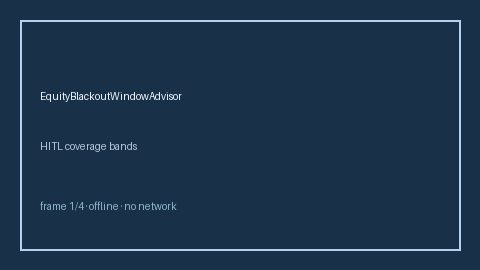

# EquityBlackoutWindowAdvisor Guide



Offline HITL advisor. Never auto-acts. Closes closed-UI gaps vs Carta/Pulley/SEC Rule 10b5-1 equity blackout-window planners.

Optional later polish via **GPT-5.5 / Claude Sonnet 4.6 / Gemini 3.x / Kimi K2**.

Distinct from `StockOptionExerciseWindowAdvisor` and `RsuRefreshCadenceAdvisor`.

## Usage

```python
from autoapply_agent.services.equity_blackout_window import EquityBlackoutWindowAdvisor

report = EquityBlackoutWindowAdvisor().advise(
    blackout_days_remaining=80.0,
    planned_liquidity_days=50.0,
)
assert report.auto_enroll is False
print(report.coverage_band)
```

## Safety

Always `requires_human_review=True`. No HTTP. Humans decide. See `SAFETY.md`.
