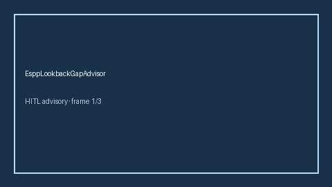

# EsppLookbackGapAdvisor Guide



Offline HITL advisor. Never auto-acts. Closes closed-UI gaps vs Fidelity/Schwab/Carta ESPP lookback-discount planners (distinct from flat ESPP discount value).

Optional later polish via **GPT-5.5 / Claude Sonnet 4.6 / Gemini 3.x / Kimi K2**.

Distinct from `EsppDiscountValueAdvisor` and `EquityVestingAdvisor`.

## Usage

```python
from autoapply_agent.services.espp_lookback_gap import EsppLookbackGapAdvisor

report = EsppLookbackGapAdvisor().advise(
    lookback_discount_pct=15.0,
    target_discount_pct=15.0,
)
assert report.auto_enroll is False
print(report.coverage_band)
```

## Safety

Always `requires_human_review=True`. No HTTP. Humans decide. See `SAFETY.md`.
