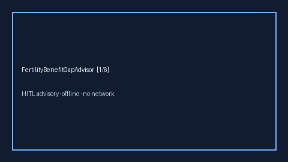

# FertilityBenefitGapAdvisor Guide



Offline HITL advisor. Never auto-claims. Closes closed-UI gaps vs Levels.fyi /
Blind / Carrot / Progyny fertility-benefit planners.

Optional later polish via **GPT-5.5 / Claude Sonnet 4.6 / Gemini 3.x / Kimi K2**.

Distinct from `TuitionReimbursementGapAdvisor` and `ParentalLeaveGapAdvisor`.

## Usage

```python
from autoapply_agent.services.fertility_benefit_gap import FertilityBenefitGapAdvisor

report = FertilityBenefitGapAdvisor().advise(
    annual_treatment_usd=20000.0,
    employer_cap_usd=15000.0,
    planned_claim_usd=15000.0,
)
assert report.auto_claim is False
assert report.requires_human_review is True
print(report.coverage_band, report.remaining_cap_usd)
```

## Safety

Always `requires_human_review=True`. No HTTP. Humans decide. See `SAFETY.md`.
