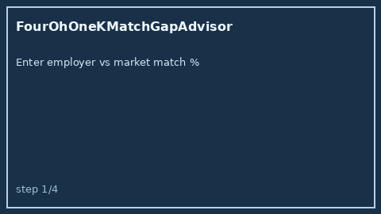

# FourOhOneKMatchGapAdvisor Guide



Offline HITL advisor. Never auto-enrolls. Closes closed-UI gaps vs Levels.fyi /
Fidelity / Candor 401(k) match calculators.

Optional later polish via **GPT-5.5 / Claude Sonnet 4.6 / Gemini 3.x / Kimi K2**.

Distinct from `EsppDiscountValueAdvisor` and `SalaryBandEstimator`.

## Usage

```python
from autoapply_agent.services.four01k_match_gap import FourOhOneKMatchGapAdvisor

report = FourOhOneKMatchGapAdvisor().advise(
    employer_match_pct=3.0,
    market_match_pct=6.0,
    salary=100_000.0,
)
assert report.auto_enroll is False
assert report.requires_human_review is True
print(report.coverage_band, report.annual_gap_usd)
```

## Safety

Always `requires_human_review=True`. No HTTP. Humans decide. See `SAFETY.md`.
