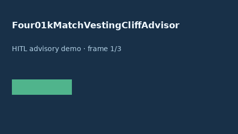

# Four01kMatchVestingCliffAdvisor Guide



Offline HITL advisor. Never auto-acts. Closes closed-UI gaps vs Fidelity/Vanguard/Schwab/Levels.fyi 401k match vesting-cliff planners.

Optional later polish via **GPT-5.5 / Claude Sonnet 4.6 / Gemini 3.x / Kimi K2**.

Distinct from `Four01kMatchGapAdvisor` and `EquityVestingAdvisor`.

## Usage

```python
from autoapply_agent.services.four01k_match_vesting_cliff import Four01kMatchVestingCliffAdvisor

report = Four01kMatchVestingCliffAdvisor().advise(
    vested_match_pct=80.0,
    target_vested_pct=50.0,
)
assert report.auto_enroll is False
print(report.coverage_band)
```

## Safety

Always `requires_human_review=True`. No HTTP. Humans decide. See `SAFETY.md`.
