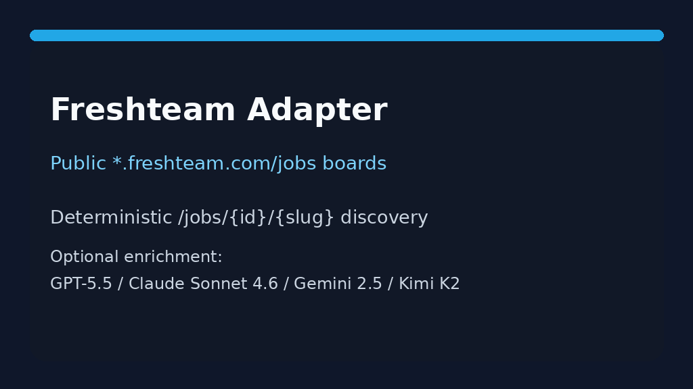

# Freshteam Source Guide



Use this guide when wiring a public Freshteam (Freshworks) careers board into
**agentic-career-search**. Discovery is deterministic HTML URL-shape matching —
enrichment with GPT-5.5 / Claude Sonnet 4.6 / Gemini 2.5 / Kimi K2 is optional
and runs after candidates are collected.

## Why Freshteam

Freshteam (`{company}.freshteam.com/jobs`) is a popular ATS for SMB and
mid-market hiring teams. Public boards expose each job as an anchor under
`/jobs/{jobId}/{slug}`, with mixed-case ids that may include `-` or `_`
characters. This adapter mirrors the Teamtailor/Jobvite/BreezyHR URL-shape
approach used for other HTML careers sources.

## Register a source

```bash
curl -X POST localhost:8000/source-configs \
  -H 'content-type: application/json' \
  -d '{
    "name": "acme-freshteam",
    "source_type": "freshteam",
    "base_url": "https://acme.freshteam.com/jobs"
  }'
```

Any public listing URL for the tenant works. The adapter extracts postings from:

| Shape | Example |
|---|---|
| Job id + slug | `/jobs/aQOc95c23C-j/accounting-clerk` |
| Job id only | `/jobs/AbCdEf123456` |
| Job id + tracking query | `/jobs/aQOc95c23C-j/accounting-clerk?ft_source=4000096128` |

Apply/login steps (`/jobs/{jobId}/{slug}/apply`, `/jobs/{jobId}/application`)
and board navigation links are ignored.

## What you get

| Field | Source |
|---|---|
| `title` | Anchor text, else `title` / `aria-label` / `data-portal-title` |
| `location` | `data-portal-location`, remote flag, or nearest posting-container location text |
| `external_id` | `/jobs/{jobId}` token |
| `url` | Absolute posting URL |
| `company` | Host-derived token |

## Safety notes

- Public careers pages only — no authenticated Freshteam APIs.
- Outbound User-Agent comes from settings.
- Parsing stops at `max_jobs`; no unbounded crawl.

See ADR-092 for the design decision.
