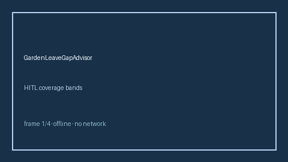

# GardenLeaveGapAdvisor Guide



Offline HITL advisor. Never auto-acts. Closes closed-UI gaps vs Clerky/Blind/Levels.fyi garden-leave planners.

Optional later polish via **GPT-5.5 / Claude Sonnet 4.6 / Gemini 3.x / Kimi K2**.

Distinct from `NonCompeteGeoScopeAdvisor` and `NonCompeteFlagger`.

## Usage

```python
from autoapply_agent.services.garden_leave_gap import GardenLeaveGapAdvisor

report = GardenLeaveGapAdvisor().advise(
    garden_leave_days=80.0,
    needed_transition_days=50.0,
)
assert report.auto_enroll is False
print(report.coverage_band)
```

## Safety

Always `requires_human_review=True`. No HTTP. Humans decide. See `SAFETY.md`.
