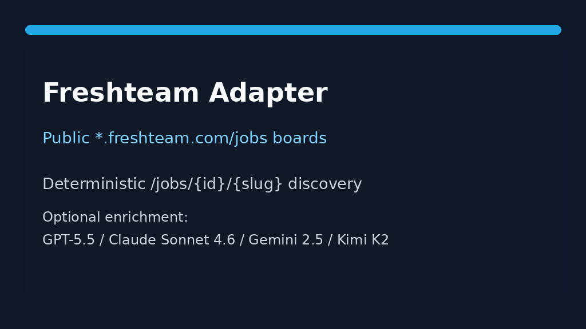

# Gem Source Guide



Use this guide when wiring a public Gem careers board into
**agentic-career-search**. Discovery is deterministic HTML URL-shape matching —
enrichment with GPT-5.5 / Claude Sonnet 4.6 / Gemini 3.x / Kimi K2 is optional
and runs after candidates are collected.

## Why Gem

Gem (`jobs.gem.com`) is a widely used ATS and recruiting CRM for growth and
enterprise hiring teams. Public boards expose each job as an anchor under
`/{company}/{jobId}` on `jobs.gem.com`, or under `/careers/...` on
`{company}.gem.com` vanity domains. This adapter mirrors the
Freshteam/Teamtailor/Pinpoint URL-shape approach used for other HTML careers
sources.

## Register a source

```bash
curl -X POST localhost:8000/source-configs \
  -H 'content-type: application/json' \
  -d '{
    "name": "acme-gem",
    "source_type": "gem",
    "base_url": "https://jobs.gem.com/acme"
  }'
```

Any public listing URL for the tenant works. The adapter extracts postings from:

| Shape | Example |
|---|---|
| Company + job id | `/doowii/am9icG9zdDpFgfzkVhSJrW-sCsfQosvr` |
| Jobs prefix | `/jobs/opening-48291` |
| Openings prefix | `/openings/role-22222` |
| Vanity careers | `https://acme.gem.com/careers/am9icG9zdDpFgfzkVhSJrW-sCsfQosvr` |
| Vanity careers + jobs | `/careers/jobs/opening-48291` |

Board index pages (`/doowii`), apply/login steps (`/{jobId}/apply`), and
navigation links are ignored.

## What you get

| Field | Source |
|---|---|
| `title` | Anchor text, else `title` / `aria-label` / `data-job-title` |
| `location` | `data-location` / `data-job-location`, remote flag, or nearest posting-container location text |
| `external_id` | Terminal `{jobId}` or `{id}` token |
| `url` | Absolute posting URL |
| `company` | Host-derived token |

## Safety notes

- Public careers pages only — no authenticated Gem Job Board APIs.
- Outbound User-Agent comes from settings.
- Parsing stops at `max_jobs`; no unbounded crawl.

See ADR-100 for the design decision.
