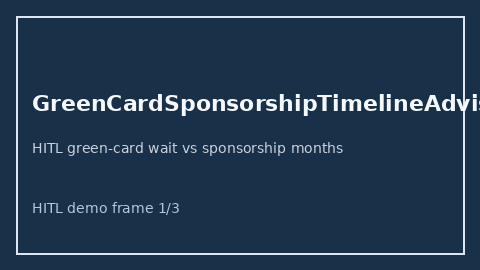

# GreenCardSponsorshipTimelineAdvisor Guide



Offline HITL advisor. Never auto-acts. Closes closed-UI gaps vs Boundless/MyVisaJobs/Trackitt green-card sponsorship timeline planners.

Optional later polish via **GPT-5.5 / Claude Sonnet 4.6 / Gemini 3.x / Kimi K2**.

Distinct from `VisaTimelineGapAdvisor` and `H1bLotteryOddsAdvisor`.

## Usage

```python
from autoapply_agent.services.green_card_sponsorship_timeline import (
    GreenCardSponsorshipTimelineAdvisor,
)

report = GreenCardSponsorshipTimelineAdvisor().advise(
    sponsored_months=48.0,
    wait_months=36.0,
)
assert report.auto_enroll is False
print(report.coverage_band)
```

## Safety

Always `requires_human_review=True`. No HTTP. Humans decide. See `SAFETY.md`.
