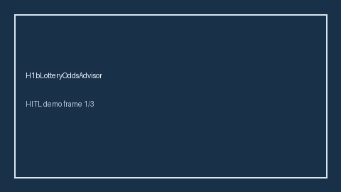

# H1bLotteryOddsAdvisor Guide



Offline HITL advisor. Never auto-acts. Closes closed-UI gaps vs MyVisaJobs/H1BGrader/Boundless H-1B lottery odds planners.

Optional later polish via **GPT-5.5 / Claude Sonnet 4.6 / Gemini 3.x / Kimi K2**.

Distinct from ``VisaTimelineGapAdvisor` and `VisaSponsorshipSignalExtractor``.

## Usage

```python
from autoapply_agent.services.h1b_lottery_odds import H1bLotteryOddsAdvisor

report = H1bLotteryOddsAdvisor().advise(
    selected_registrations=2.0,
    target_registrations=3.0,
)
assert report.auto_enroll is False
print(report.coverage_band)
```

## Safety

Always `requires_human_review=True`. No HTTP. Humans decide. See `SAFETY.md`.
