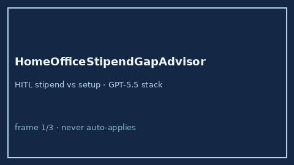

# HomeOfficeStipendGapAdvisor Guide



Offline HITL advisor. Never auto-accepts. Closes closed-UI gaps vs Rippling /
Levels.fyi / Candor home-office stipend calculators.

Optional later polish via **GPT-5.5 / Claude Sonnet 4.6 / Gemini 3.x / Kimi K2**.

Distinct from `CommuteCostTradeoffAdvisor` and `RelocationPackageGapAdvisor`.

## Usage

```python
from autoapply_agent.services.home_office_stipend_gap import HomeOfficeStipendGapAdvisor

report = HomeOfficeStipendGapAdvisor().advise(
    stipend_annual_usd=750.0,
    setup_cost_usd=1200.0,
)
assert report.auto_accept is False
assert report.requires_human_review is True
print(report.coverage_band, report.gap_usd)
```

## Safety

Always `requires_human_review=True`. No HTTP. Humans decide. See `SAFETY.md`.
