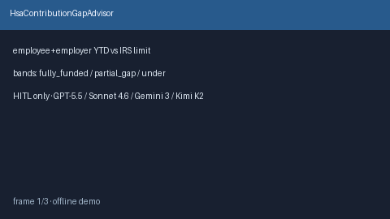

# HsaContributionGapAdvisor Guide



Offline HITL advisor. Never auto-enrolls. Closes closed-UI gaps vs Fidelity /
HealthEquity / Levels.fyi HSA contribution planners.

Optional later polish via **GPT-5.5 / Claude Sonnet 4.6 / Gemini 3.x / Kimi K2**.

Distinct from `FourOhOneKMatchGapAdvisor` and `EsppDiscountValueAdvisor`.

## Usage

```python
from autoapply_agent.services.hsa_contribution_gap import HsaContributionGapAdvisor

report = HsaContributionGapAdvisor().advise(
    employee_ytd_usd=2000.0,
    employer_ytd_usd=500.0,
    irs_limit_usd=4300.0,
)
assert report.auto_enroll is False
assert report.requires_human_review is True
print(report.coverage_band, report.remaining_room_usd)
```

## Safety

Always `requires_human_review=True`. No HTTP. Humans decide. See `SAFETY.md`.
