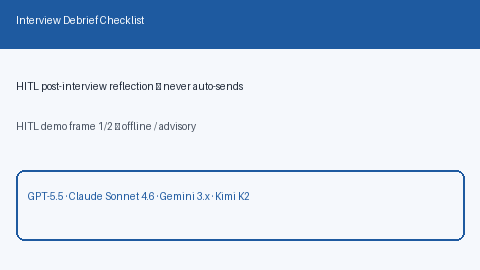

# Interview Debrief Checklist Guide



Generate deterministic, offline **post-interview debrief checklists** from
structured what-went-well / gaps / follow-ups. Never auto-sends notes. Closes
the gap vs Teal/Huntr interview trackers that bury reflection prompts inside
proprietary UIs.

Optional later polish via **GPT-5.5 / Claude Sonnet 4.6 / Gemini 3.x / Kimi K2**.
The checklist assembly itself stays deterministic.

Distinct from `ThankYouNoteOutlinePlanner` (outbound thank-you outlines),
`InterviewPrepBriefService` (pre-interview prep), and
`InterviewFeedbackSynthesizer` (free-text note synthesis).

## Why this exists

After interviews, candidates need a repeatable HITL reflection ritual — not
another auto-send template. Closed trackers show notes, but few open-source
career agents expose a local checklist with explicit human-review gates. This
service always sets `requires_human_review=True`, keeps `auto_submit=False`,
and performs no network I/O.

## Usage

```python
from autoapply_agent.services.interview_debrief import InterviewDebriefChecklist

plan = InterviewDebriefChecklist().build(
    company="Acme",
    role="Backend Engineer",
    what_went_well=["Clear system design"],
    gaps=["Weak concurrency story"],
    follow_ups=["Send architecture sketch"],
)
assert plan.requires_human_review is True
assert plan.auto_submit is False
print(plan.checklist)
print(plan.guidance)
```

## Safety

Always `requires_human_review=True` and `auto_submit=False`. No HTTP. Humans
decide whether to send any follow-up. See `SAFETY.md`.
