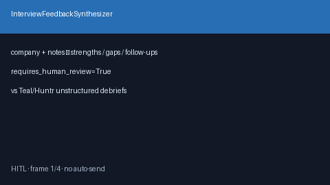

# Interview Feedback Synthesizer Guide



Generate deterministic, offline **post-interview debrief briefs** from free-text
notes for human review. Never contacts recruiters. Closes the gap vs Teal/Huntr
interview trackers and ad-hoc Notion debriefs that stay unstructured.

Optional later polish via **GPT-5.5 / Claude Sonnet 4.6 / Gemini 3.x / Kimi K2**.
The brief itself stays deterministic.

## Why this exists

Teal and Huntr track stages; few open-source career agents synthesize interview
notes into strengths / gaps / follow-ups with a HITL gate. This service closes
that gap with a testable primitive that always sets `requires_human_review=True`
and performs no network I/O.

## Usage

```python
from autoapply_agent.services.interview_feedback import InterviewFeedbackSynthesizer

brief = InterviewFeedbackSynthesizer().synthesize(
    company="Nimbus",
    role="ML Engineer",
    notes="Strong ownership story; deferred on on-call details",
    outcome_signal="mixed",
)
assert brief.requires_human_review is True
print(brief.strengths)
print(brief.gaps)
print(brief.follow_ups)
```

Supported `outcome_signal` values: `positive`, `mixed`, `negative`, `unknown`.

## Safety

Always `requires_human_review=True`. No HTTP. Humans edit and send follow-ups
manually. See `SAFETY.md`.
