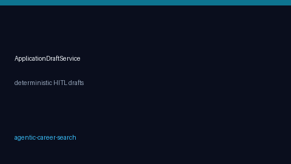

# Interview Prep Brief Guide



Generate a **human-reviewed** interview-prep package from a job title, company,
optional job description, and optional candidate skills. Output is deterministic
and network-free — it never messages recruiters or books interviews.

Optional later LLM polish can use GPT-5.5 / Claude Sonnet 4.6 / Gemini 3.x /
Kimi K2. The brief generator itself stays SAFETY-aligned and assistive only.

## Why this exists

Teal and Simplify emphasize pipeline UI and tailored materials, but they do not
ship a composable interview-prep brief inside an agent loop. JobSpy scrapes
boards without prep assist. OpenHands-style agents can browse calendars or
inboxes, which is the wrong default for interview coaching. This service fills
the gap with **HITL-only** likely questions, STAR prompts, and focus gaps.

## Generate a brief

```python
from autoapply_agent.services.interview_prep import InterviewPrepBriefService

brief = InterviewPrepBriefService().generate(
    job_title="Senior Backend Engineer",
    company="Acme Labs",
    job_text="Build FastAPI services on AWS with strong Python skills.",
    candidate_skills=["python"],
)

assert brief.requires_human_review is True
print(brief.likely_questions)
print(brief.star_prompts)
print(brief.focus_gaps)
```

## What you get

| Field | Purpose |
|---|---|
| `likely_questions` | Role/company-aware interview questions |
| `star_prompts` | STAR story scaffolding + optional skill bonus |
| `focus_gaps` | JD keyword hints missing from candidate skills |
| `requires_human_review` | Always `True` |

## Safety notes

- No recruiter outreach, calendar booking, or credential automation.
- Output is assistive prep content for human editing.
- Treat gaps as triage hints, not hiring decisions.

See `SAFETY.md` for project-wide boundaries.
