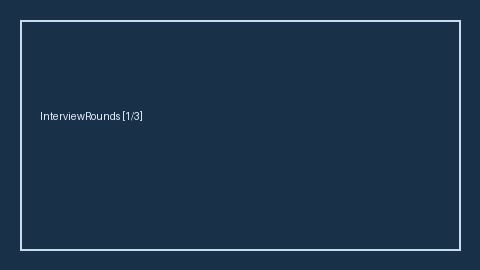

# Interview Round Progress Tracker Guide



Track multi-round interview progress with explicit allowed transitions. Never
auto-advances. Closes the Huntr / Teal / Jobtracker multi-round board gap.

Optional later polish via **GPT-5.5 / Claude Sonnet 4.6 / Gemini 3.x / Kimi K2**.

Distinct from `ApplicationStageTracker` and `PhoneScreenAgendaPlanner`.

## Usage

```python
from autoapply_agent.services.interview_rounds import InterviewRoundProgressTracker

tracker = InterviewRoundProgressTracker()
tracker.start("app-42")
tracker.advance("app-42", "hiring_manager")
snap = tracker.advance("app-42", "onsite")
assert snap.auto_advance is False
assert snap.requires_human_review is True
print(snap.round_name, snap.history)
```

## Safety

Always `requires_human_review=True` and `auto_advance=False`. No HTTP. Humans
decide round advances. See `SAFETY.md`.
