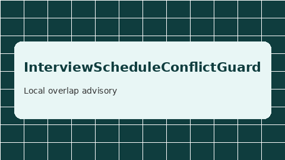

# Interview Schedule Conflict Guard Guide



Detect **local interview calendar overlaps** for human review. Never writes
calendars. Closes the gap vs Teal/Huntr calendar sync that auto-writes events.

Optional later polish via **GPT-5.5 / Claude Sonnet 4.6 / Gemini 3.x / Kimi K2**.
The overlap check itself stays deterministic.

## Why this exists

Teal and Huntr can sync interviews into calendars automatically. Open-source
career agents rarely expose a local, offline conflict advisory that keeps
humans in the loop. This guard always sets `requires_human_review=True`, keeps
`calendar_mutated=False`, and performs no network I/O.

## Usage

```python
from autoapply_agent.services.interview_schedule_conflict import (
    InterviewScheduleConflictGuard,
    InterviewSlot,
)

report = InterviewScheduleConflictGuard().check(
    proposed=InterviewSlot(
        start_iso="2026-09-15T10:00:00",
        end_iso="2026-09-15T11:00:00",
        label="Acme onsite",
    ),
    existing=[
        InterviewSlot(
            start_iso="2026-09-15T10:30:00",
            end_iso="2026-09-15T11:30:00",
            label="Globex screen",
        ),
    ],
)
assert report.requires_human_review is True
assert report.calendar_mutated is False
print(report.has_conflict, report.conflicts)
```

Touching endpoints (end == next start) are **not** treated as conflicts.

## Safety

Always `requires_human_review=True` and `calendar_mutated=False`. No HTTP.
Humans decide whether to reschedule or accept the overlap. See `SAFETY.md`.
