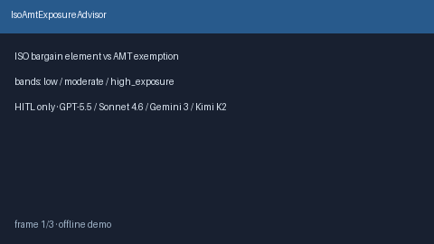

# IsoAmtExposureAdvisor Guide



Offline HITL advisor. Never auto-exercises. Closes closed-UI gaps vs Carta /
Pulley / Levels.fyi ISO AMT calculators.

Optional later polish via **GPT-5.5 / Claude Sonnet 4.6 / Gemini 3.x / Kimi K2**.

Distinct from `EquityVestingCliffAdvisor` and `EsppDiscountValueAdvisor`.

## Usage

```python
from autoapply_agent.services.iso_amt_exposure import IsoAmtExposureAdvisor

report = IsoAmtExposureAdvisor().advise(
    shares_exercised=5000,
    fmv_at_exercise=30.0,
    strike_price=10.0,
    amt_exemption_usd=80000.0,
)
assert report.auto_exercise is False
assert report.requires_human_review is True
print(report.exposure_band, report.bargain_element_usd)
```

## Safety

Always `requires_human_review=True`. No HTTP. Humans decide. See `SAFETY.md`.
