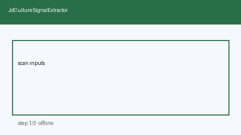

# JD Culture Signal Extractor Guide



Extract deterministic, offline **culture signals** from JD text (pace, on-call,
collaboration, meeting load, autonomy, work-life cues). Never auto-applies.
Closes the gap vs Teal/LinkedIn insight panels locked in proprietary UIs.

Optional later polish via **GPT-5.5 / Claude Sonnet 4.6 / Gemini 3.x / Kimi K2**.
Extraction itself stays deterministic.

Distinct from `LocationRemoteFitScorer` and `CompanyResearchBriefService`.

## Usage

```python
from autoapply_agent.services.jd_culture_signals import JdCultureSignalExtractor

report = JdCultureSignalExtractor().extract(
    company="Acme",
    role="Backend Engineer",
    jd_text="Fast-paced team with on-call and cross-functional collaboration.",
)
assert report.requires_human_review is True
assert report.auto_apply is False
print(report.signals)
```

## Safety

Always `requires_human_review=True` and `auto_apply=False`. No HTTP. Humans
decide whether to apply. See `SAFETY.md`.
