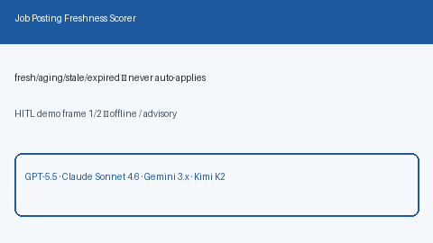

# Job Posting Freshness Scorer Guide



Generate deterministic, offline **job posting freshness bands** from
`age_days`. Never auto-applies. Closes the gap vs Teal/Huntr/Simplify boards
that hide posting age inside proprietary UIs.

Optional later polish via **GPT-5.5 / Claude Sonnet 4.6 / Gemini 3.x / Kimi K2**.
The freshness math itself stays deterministic.

Distinct from `CrossSourceJobDeduper` (near-duplicate clustering).

## Why this exists

Stale evergreen postings waste candidate time. Closed boards surface age
poorly or not at all for agent triage. This service always sets
`requires_human_review=True`, keeps `auto_apply=False`, and performs no
network I/O.

## Usage

```python
from autoapply_agent.services.job_freshness import JobPostingFreshnessScorer

advice = JobPostingFreshnessScorer().score(
    age_days=30,
    title="ML Engineer",
    company="Acme",
)
assert advice.requires_human_review is True
assert advice.auto_apply is False
print(advice.band, advice.freshness_score)
print(advice.guidance)
```

Bands: `fresh` (0–7 days), `aging` (8–21), `stale` (22–45), `expired` (46+).

## Safety

Always `requires_human_review=True` and `auto_apply=False`. No HTTP. Humans
decide whether to apply. See `SAFETY.md`.
