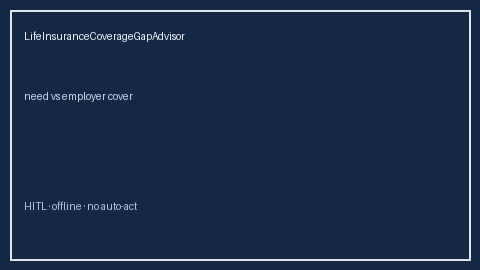

# LifeInsuranceCoverageGapAdvisor Guide



Offline HITL advisor. Never auto-acts. Closes closed-UI gaps vs MetLife/Guardian/Prudential/Levels.fyi life-insurance planners.

Optional later polish via **GPT-5.5 / Claude Sonnet 4.6 / Gemini 3.x / Kimi K2**.

Distinct from `LtdDisabilityGapAdvisor` and `IdentityTheftProtectionGapAdvisor`.

## Usage

```python
from autoapply_agent.services.life_insurance_coverage_gap import LifeInsuranceCoverageGapAdvisor

report = LifeInsuranceCoverageGapAdvisor().advise(
    annual_income_need_usd=1800.0,
    employer_life_cover_usd=1200.0,
    planned_cover_usd=1200.0,
)
assert report.auto_enroll is False
assert report.requires_human_review is True
print(report.coverage_band, report.remaining_cap)
```

## Safety

Always `requires_human_review=True`. No HTTP. Humans decide. See `SAFETY.md`.
