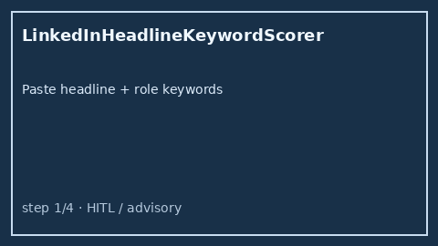

# LinkedIn Headline Keyword Scorer Guide



Score an offline LinkedIn headline against target role keywords. Never
auto-posts profile updates. Closes the Careerflow / Taplio / LinkedIn Premium
headline-grader gap.

Optional later polish via **GPT-5.5 / Claude Sonnet 4.6 / Gemini 3.x / Kimi K2**.

Distinct from `AtsKeywordCoverageScorer` and `SkillsProfileFitScorer`.

## Usage

```python
from autoapply_agent.services.linkedin_headline import LinkedInHeadlineKeywordScorer

report = LinkedInHeadlineKeywordScorer().score(
    "Senior Python Engineer | FastAPI | Distributed Systems",
    ["python", "fastapi", "kubernetes", "distributed systems"],
)
assert report.requires_human_review is True
assert report.auto_post is False
print(report.coverage_score, report.missing_keywords)
```

## Safety

Always `requires_human_review=True` and `auto_post=False`. No HTTP. Humans edit
and publish headlines. See `SAFETY.md`.
