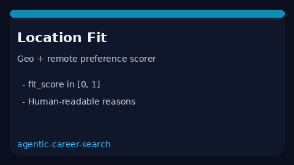

# Location / Remote Fit Guide



Score candidate **geo + remote preferences** against a posting's location and
remote policy. Returns `fit_score` in `[0.0, 1.0]` plus human-readable reasons.
Closes the gap vs RemoteOK / WeWorkRemotely preference filters that are
board-UI-only.

Optional later narrative polish via **GPT-5.5 / Claude Sonnet 4.6 / Gemini 3.x /
Kimi K2**. The score itself stays deterministic.

## Why this exists

RemoteOK and WeWorkRemotely expose preference filters only inside their UIs.
This service closes the gap with a testable offline scorer for agentic triage.

## Usage

```python
from autoapply_agent.services.location_remote_fit import LocationRemoteFitScorer

result = LocationRemoteFitScorer().score(
    candidate_locations=["Austin, TX"],
    prefers_remote=True,
    posting_location="Remote - US",
    posting_remote_policy="Fully remote",
)
print(result.fit_score)
print(result.reasons)
```

## Safety

Assistive heuristic only. No HTTP. Humans confirm relocation / visa / timezone
constraints before applying. See `SAFETY.md`.
