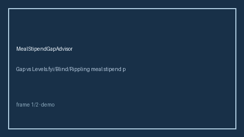

# MealStipendGapAdvisor Guide



Offline HITL advisor. Never auto-acts. Closes closed-UI gaps vs Levels.fyi/Blind/Rippling meal stipend planners.

Optional later polish via **GPT-5.5 / Claude Sonnet 4.6 / Gemini 3.x / Kimi K2**.

Distinct from `WellnessStipendGapAdvisor` and `HomeOfficeStipendGapAdvisor`.

## Usage

```python
from autoapply_agent.services.meal_stipend_gap import MealStipendGapAdvisor

report = MealStipendGapAdvisor().advise(
    stipend_usd=80.0,
    monthly_food_cost_usd=50.0,
)
assert report.auto_enroll is False
print(report.coverage_band)
```

## Safety

Always `requires_human_review=True`. No HTTP. Humans decide. See `SAFETY.md`.
