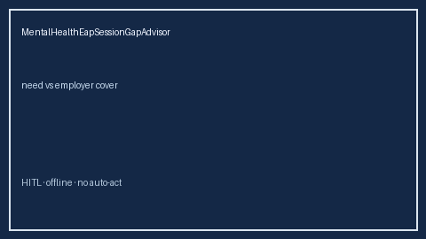

# MentalHealthEapSessionGapAdvisor Guide



Offline HITL advisor. Never auto-acts. Closes closed-UI gaps vs Lyra/Spring Health/Modern Health/Levels.fyi EAP session planners.

Optional later polish via **GPT-5.5 / Claude Sonnet 4.6 / Gemini 3.x / Kimi K2**.

Distinct from `WellnessStipendGapAdvisor` and `LegalInsuranceGapAdvisor`.

## Usage

```python
from autoapply_agent.services.mental_health_eap_session_gap import MentalHealthEapSessionGapAdvisor

report = MentalHealthEapSessionGapAdvisor().advise(
    needed_sessions_per_year=1800.0,
    employer_session_cap=1200.0,
    planned_sessions=1200.0,
)
assert report.auto_book is False
assert report.requires_human_review is True
print(report.coverage_band, report.remaining_cap)
```

## Safety

Always `requires_human_review=True`. No HTTP. Humans decide. See `SAFETY.md`.
