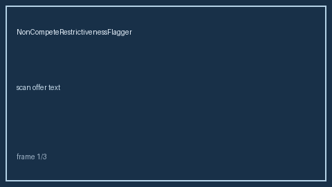

# Non-Compete Restrictiveness Flagger Guide



Flag non-compete duration, geography, and garden-leave cues from offer text.
Never auto-accepts. Closes the Blind / Levels.fyi / Candor restrictiveness gap.

Optional later polish via **GPT-5.5 / Claude Sonnet 4.6 / Gemini 3.x / Kimi K2**.

Distinct from `VisaSponsorshipSignalExtractor` and `JdCultureSignalExtractor`.

## Usage

```python
from autoapply_agent.services.noncompete_flagger import NonCompeteRestrictivenessFlagger

report = NonCompeteRestrictivenessFlagger().flag(
    "Employee agrees to a non-compete for 24 months worldwide."
)
assert report.auto_accept is False
print(report.restrictiveness_band, report.duration_months)
```

## Safety

Always `requires_human_review=True` and `auto_accept=False`. No HTTP. Counsel
should review enforceability. See `SAFETY.md`.
