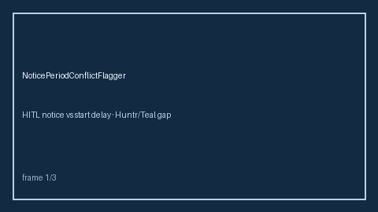

# Notice Period Conflict Flagger Guide



Compare contractual notice weeks against preferred start delay. Never
auto-accepts. Closes the Huntr / Teal / Greenhouse start-date planner gap.

Optional later polish via **GPT-5.5 / Claude Sonnet 4.6 / Gemini 3.x / Kimi K2**.

Distinct from `InterviewScheduleConflictGuard` and `OfferDeadlineTracker`.

## Usage

```python
from autoapply_agent.services.notice_period_conflict import NoticePeriodConflictFlagger

report = NoticePeriodConflictFlagger().flag(
    notice_weeks=4.0,
    preferred_start_days=14.0,
)
assert report.auto_accept is False
assert report.requires_human_review is True
print(report.conflict_band, report.slack_days)
```

## Safety

Always `requires_human_review=True` and `auto_accept=False`. No HTTP. Humans
decide start-date negotiation. See `SAFETY.md`.
