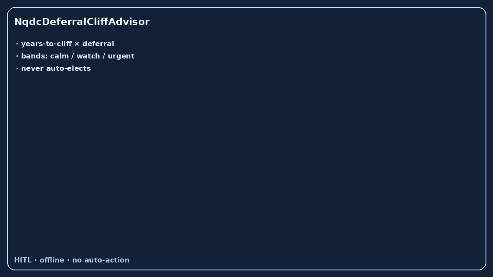

# NqdcDeferralCliffAdvisor Guide



Offline HITL advisor. Never auto-elects. Closes closed-UI gaps vs Fidelity /
Carta / Levels.fyi NQDC deferred-comp planners.

Optional later polish via **GPT-5.5 / Claude Sonnet 4.6 / Gemini 3.x / Kimi K2**.

Distinct from `EquityVestingCliffAdvisor` and `IsoAmtExposureAdvisor`.

## Usage

```python
from autoapply_agent.services.nqdc_deferral_cliff import NqdcDeferralCliffAdvisor

report = NqdcDeferralCliffAdvisor().advise(
    years_to_cliff=3.0,
    deferral_usd=120000.0,
    tax_rate_delta=0.04,
)
assert report.auto_elect is False
assert report.requires_human_review is True
print(report.cliff_band, report.cliff_pressure)
```

## Safety

Always `requires_human_review=True`. No HTTP. Humans decide. See `SAFETY.md`.
